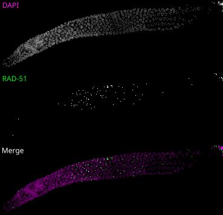
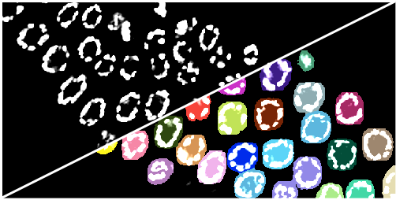
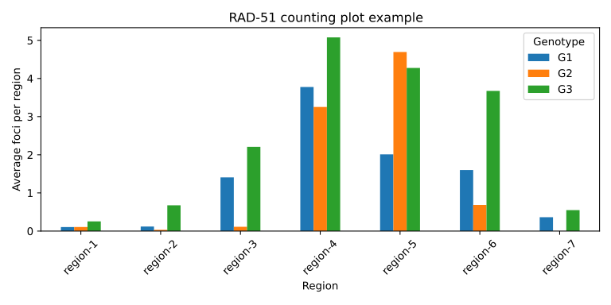

# carltonlab-napari-tools

[](https://github.com/carlosmariorr/carltonlab-napari-tools/raw/main/LICENSE)
[](https://pypi.org/project/carltonlab-napari-tools)
[](https://python.org)
[](https://github.com/carlosmariorr/carltonlab-napari-tools/actions)
[](https://napari-hub.org/plugins/carltonlab-napari-tools)
[](https://napari.org/stable/plugins/index.html)
[](https://github.com/copier-org/copier)

## About the plugin

Work in progress, please expect bugs V0.1.0

This napari plugin is a tool designed to computationally count the number of foci in microscopy of
_C. elegans_ gonads. It has two operational methods, manual and automatic counting. It uses `ndevio`
to extract the required metadata and uses `multiview-stitcher` to stitch the gonad tiles into a single
image.

<p align="center">
  
</p>

The tool was designed for RAD-51 foci counting in 4D images (CZYX) since it is the most common assay
for quantification of DSBs in _C. elegans_ but can be used to count other foci in any image.

It features multi-gonad project creation where all genotypes and gonads are mixed after individual
nuclei are selected (manual or automatic) and are scored in a blind manner to minimize human bias.

We recommend using the automatic process, which uses a trained `cellpose` model to segment the
nuclei. By default, it uses our trained model:
<https://bioimage.io/#/artifacts/sneaky-panda>.

<p align="center">
  
</p>

For the automatic counting, it uses `spotiflow` with a default model and then point filtering
based on user provided parameters such as expected foci volume, channel (usually DAPI)
co-localization and more.

It'll export the data as plots that can be organized by genotype similar to the conventional RAD-51
scoring figures commonly used in papers.

<p align="center">
  
</p>

It also writes all the intermediate files for troubleshooting, data archive and manual inspection.
Formats are `OME-Zarr` for tiles and stitched images, `TIFF` files for cropped nuclei, `CSV` files
for foci coordinates and feature tables. All which are easy to inspect even without the tool.

You can also do the entire counting and refinement of the data using the manual process.

## Use manual (coming soon)

## Installation

Clone the repository and enter its directory:

```sh
git clone git@github.com:carltonlab/carltonlab-napari-tools.git
cd carltonlab-napari-tools
```

Select what segmentation you'll be using (Automatic workflow only).

For the manual workflow, install napari and Qt without the segmentation
models:

```sh
uv sync --extra all
```

For automatic segmentation on CPU, use:

```sh
uv sync --extra full-cpu
```

For automatic segmentation with CUDA 12, use:

```sh
uv sync --extra full-cuda12
```

We highly recommend using a GPU for the segmentation. Depending on the setup, you might need to
install a different `PyTorch` version.

For our workflow, with approximately 2 × 50 × 1024 × 1024 (CZYX) images,
segmentation and foci counting use about 6 GB
of VRAM.

## Running

Launch napari using the uv environment:

```sh
uv run napari
```

Then, use the Plugins menu to launch the tool.

## Contributing

Contributions are very welcome.

## License

Distributed under the terms of the
[BSD-3](https://opensource.org/licenses/BSD-3-Clause) license,
"carltonlab-napari-tools" is free and open source software
